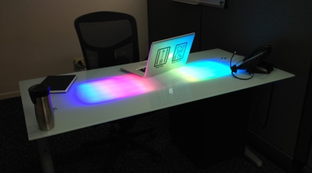

# Desklights2

## Overview

The Desklights project is an ambient information display built into a desk. The desk receives real time data and event notifications via network connection and alters it's colors and patterns to provide glanceable information. It's real world uses include infrastructure monitoring, communication notifications, backlog visualizations, heat maps, assistive displays, and more. The software is entirely open source and the hardware is easily sourced and very scalable.

The project has evolved over years and each iteration has been developed with not only increased usefulness, but also keeping in mind the display of the inner workings. This has enabled me to display it well at both the Bay Area Maker and the San Diego Maker Faires. Additionally, it has been of interest in the promotion of STEAM in education. I have presented it in as little as 5 minutes, but could easily use 30 minutes to discuss it and it's uses in more detail. Several others have even adapted the code and design for use in customized art installations and assistive displays for hearing impaired users.

Video available at: https://www.youtube.com/watch?v=KVFkWWvMIpM Code on GitHub: https://github.com/mnlagrasta/DeskLights2

## Build Log

This project precedes the creation of k0dr.com and so does not have a complete build log recorded here. However, a thorough write up is provided at http://www.instructables.com/id/LED-Glass-Desk-v20/