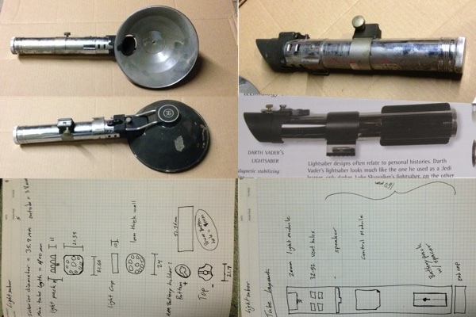

# Lightsaber

## Overview

Upon finding a vintage flash gun I realized that it was a similar model to that used by ILM to create Darth Vader's light saber. I'll be doing the following with it:

 1. Modify the shell to create a lightsaber. I am not intending to make a replica of anything from the movie. Instead, I'm following the canon idea that each jedi builds his own unique lightsaber as part of his training. In this case, mine should be unique.
 2. Repurpose the sound module from a toy lightsaber from Disneyland's "build your own lightsaber" station.
 3. Add a working flashlight so that I can actually get some use out of this thing. :)
 