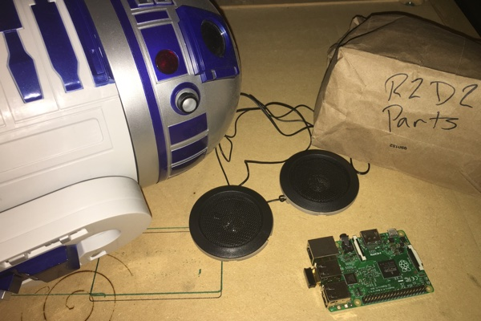

# R2Dpi

## Overview

After purchasing a basic R2D2 toy, I decided to augment it's functions with a Raspberry Pi. The first step will be using the Pi as a network enabled sound module.

## Build Log

Coming soon.