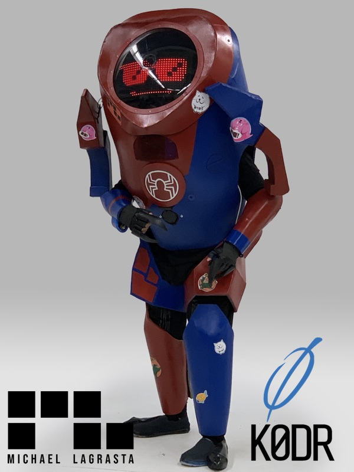
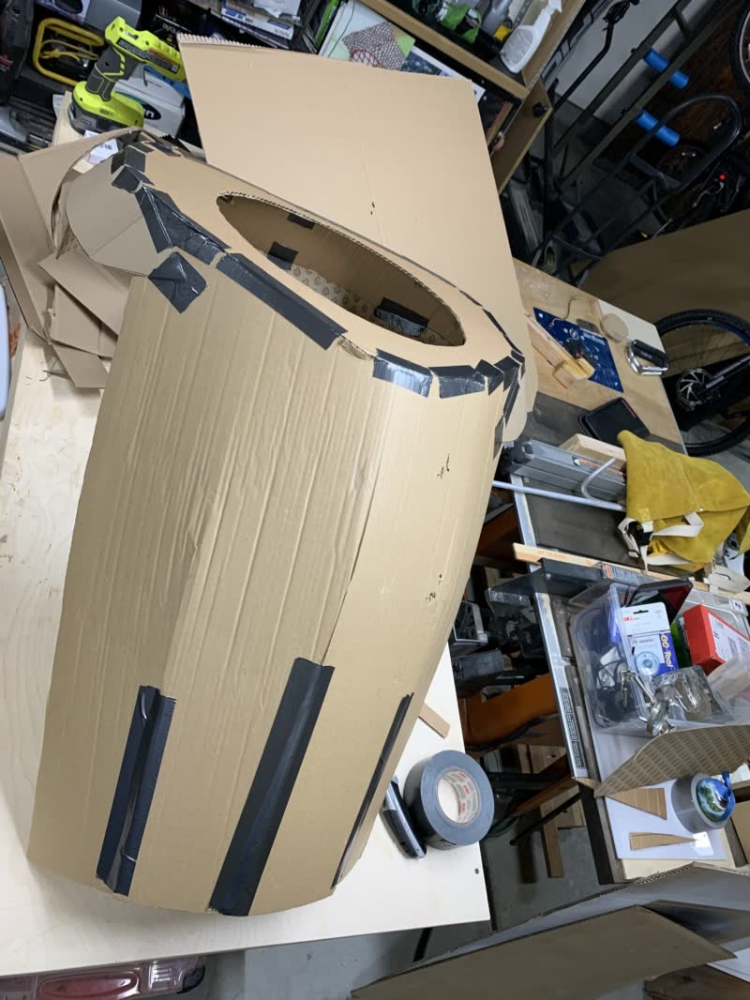
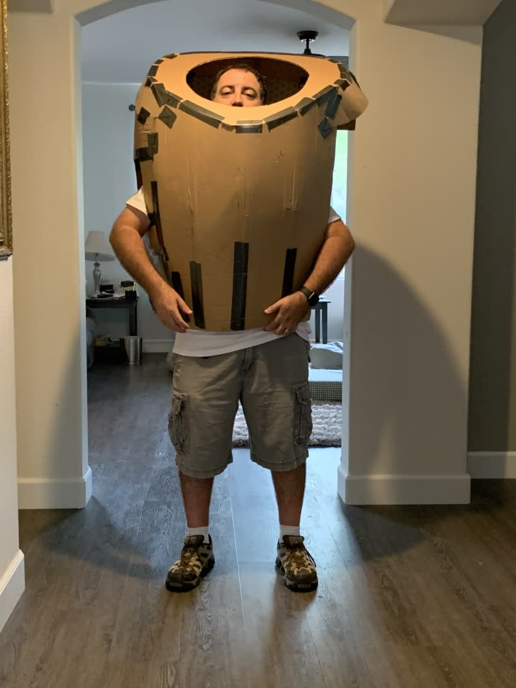
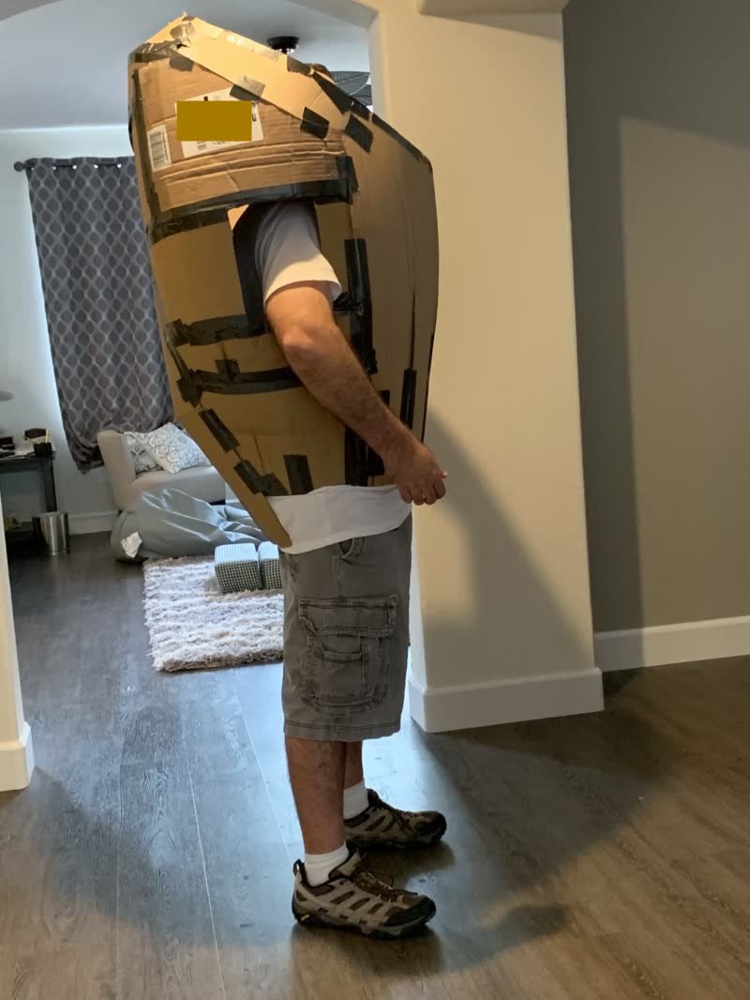
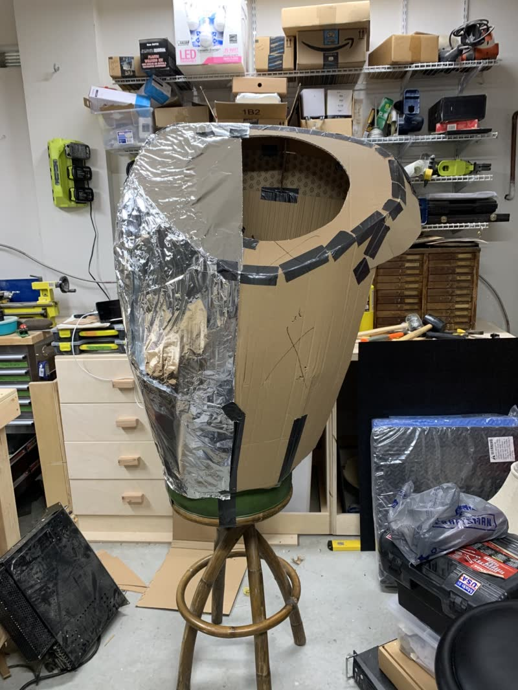
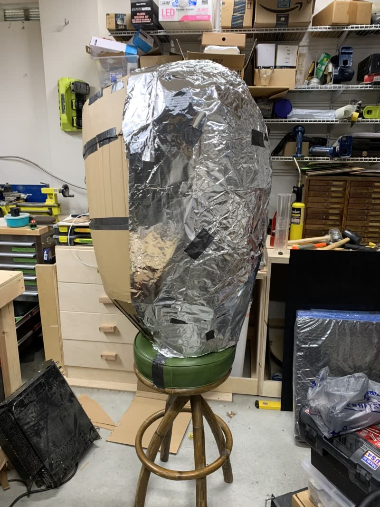
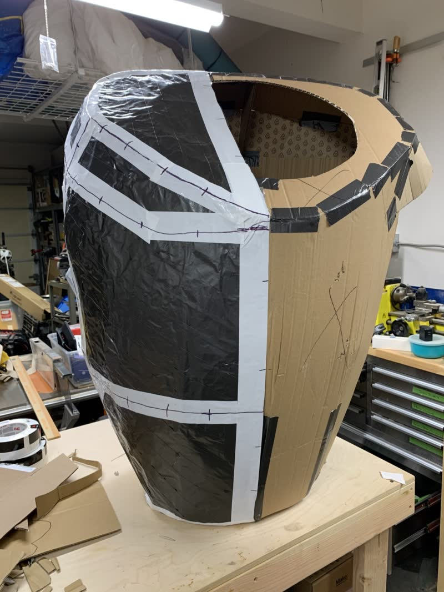
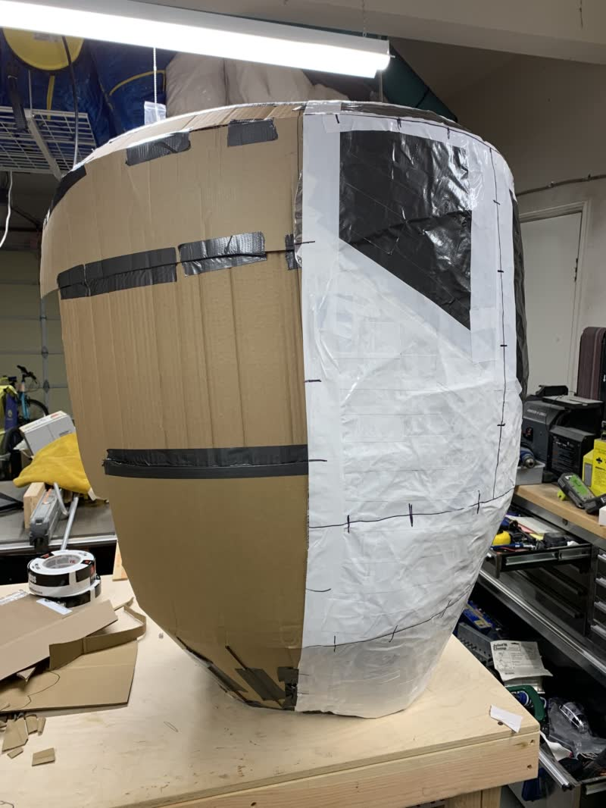
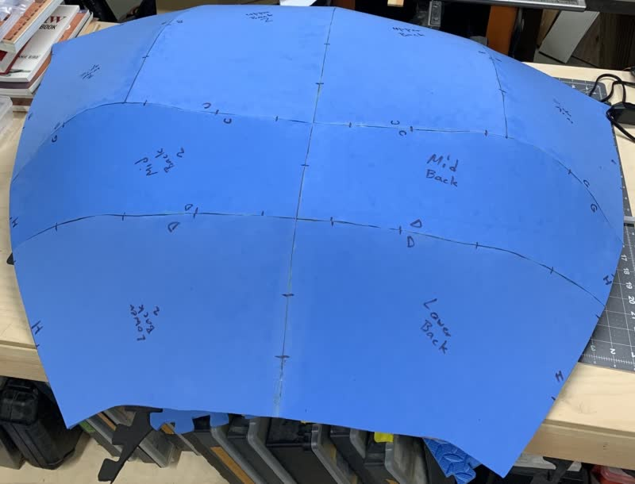

# Overview

I've always wanted to make a large robot costume for halloween. So I couldn't resist when my daughter suggested she trick or treat as Peni Parker and I as her robot, SP//dr.

# Completed photos

Photos of completed (more like ran out of time than completed) costume:

<video autoplay loop muted playsinline>
  <source src="./media/SPdr_Faces.webm" type="video/webm">
  <source src="./media/SPdr_Faces.mp4" type="video/mp4">
</video>

More images and video to follow.

# F.A.Q.

* What is it made out of?

The body is made from EVA foam (mostly floor mats), an arduino, LED matrices, zip ties, contact cement, duct tape, hot glue, PlastiDip, and spray paint.

* How long did it take?

I had to cram it in on evenings and weekends, often after the kids went to bed. My best guess is 30 - 40 hours.

* How much did it cost?

I reused a lot of parts I already had around, like the electronics, so I don't have an exact number. Here's a list of the main parts.

| Cost | Description |
|------|-------------|
| $72  | Flexible LED Matrix X 2 [Via Amazon](https://smile.amazon.com/dp/B01DC0IPVU/ref=cm_sw_r_tw_dp_U_x_DoDXDbQ3C5GF9) |
| $15  | Arduino Mega 2560 [Via Amazon](https://www.amazon.com/dp/B01H4ZLZLQ/ref=cm_sw_r_tw_dp_U_x_ZpDXDbJKGKF3P) |
| $40  | Plasti Dip X 4 |
| $7   | Wii NunChuk |
| $10  | USB hub and switch (electrical on/off) |
| $6   | I2C Wii adapter module [Via Amazon](https://smile.amazon.com/dp/B00RK1VKUQ/ref=cm_sw_r_tw_dp_U_x_XsDXDbF5PZSCQ) |
| $60  | EVA Foam Floor Mat X 3 [Via Amazon](https://smile.amazon.com/dp/B06X9TNS6F/ref=cm_sw_r_tw_dp_U_x_tuDXDbPF6NAB9) |
| $12  | spray paint X 4 |
| $222 | Estimated Total |

# Build Log

I really wanted to keep a proper build log for this project, but the pace of this build was insane. In fact, many decisions were made based on available time and the hope that I could revisit them later.

I started with a basic cardboard shape that I could use to make a pattern.

First test fit. I was initially planning to look out of the tinted dome either above or below the LED display. I later decided that wouldn't work and I shifted the arm holes down. moved the torso higher, and cut a view port in the upper chest.

I decided to reduce the width of the costume by just shifting the center line over. Since it was symmetrical, I only had to make a pattern for half the costume and mirror it while cutting out the foam.

I followed the examples seen in the great videos put out by [Punished Props Academy](https://www.youtube.com/user/punishedprops) and [Kamui Cosplay](https://www.youtube.com/user/Mogrymillian) to make my patterns. Please check them out and don't judge them on my questionable imitation ;)

Here's an example of the back of the costume after cutting and assembling several of the foam pieces.

