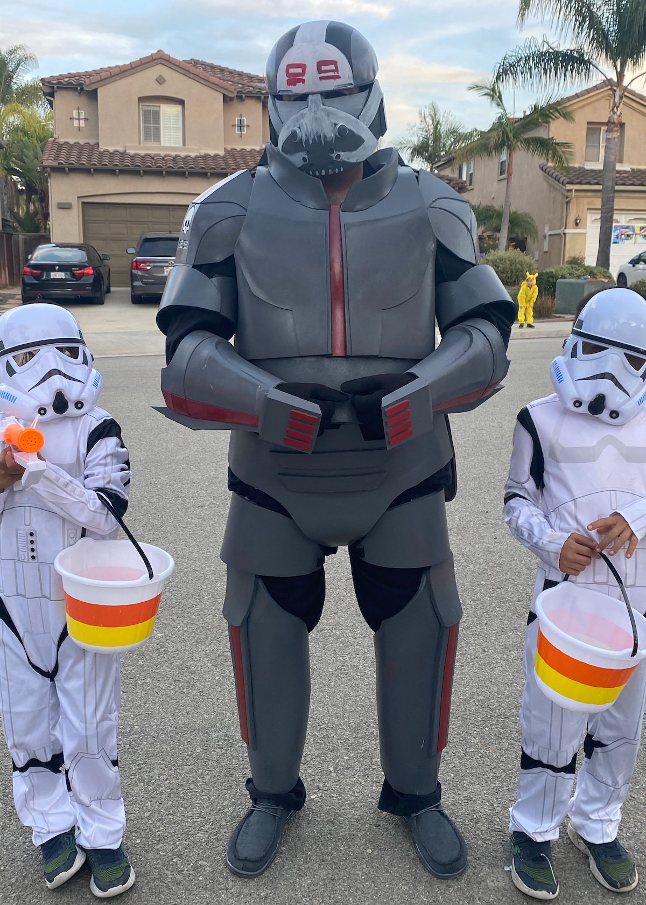
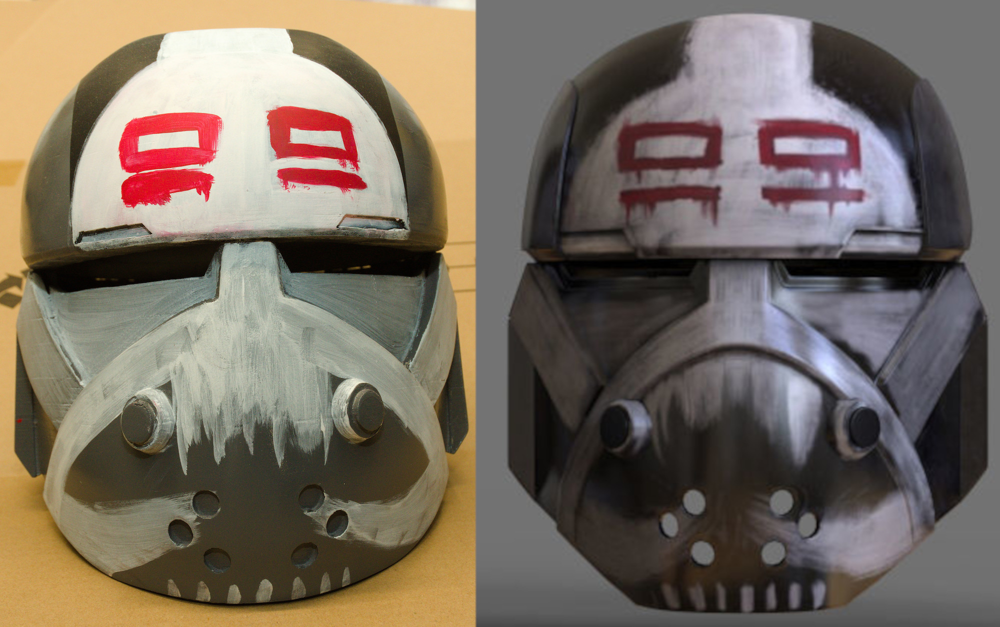
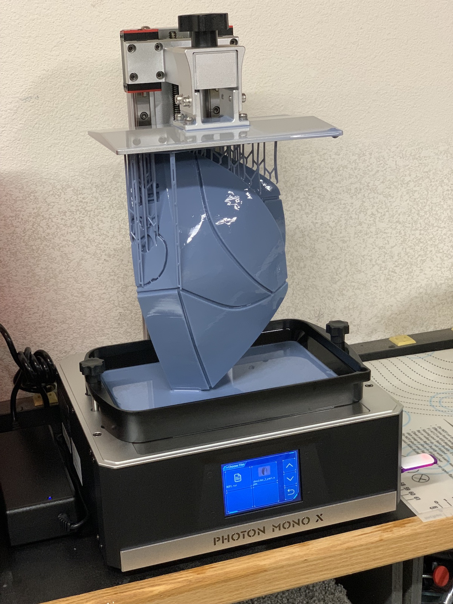
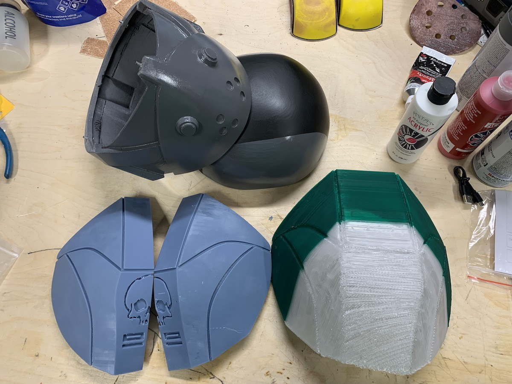

# Overview

My daughter and I decided that this year's Halloween costumes would be Wrecker and Omega from the Bad Batch Star Wars series.

# Completed photos

It seems no costume is complete, I just keep working on it up until the deadline.

# Build Log

There were some interesting learning moments on this one, especially in the comparison of different techniques. The helmet, shoulder, forearm, and wrist pieces were 3D printed. The rest of the "armor" is EVA foam. This is my second foam costume build and though it was smaller than the first, the shapes were more complex. I never did get the proportions right, but my physique is not quite the same as Wrecker.

At the time I was working on this, I had both FDM and resin based 3D printers. I also had a large diameter nozzle which could push out material very fast. On the left you can see the right shoulder piece printed in two halves. By slicing the print and carefully arranging it, I was able to print both halves together in one print run on the resin printer. That took something like 20 hours to complete but required only minimal finishing. On the right you can see the left shoulder piece (well, that is confusing) which was printed with the large FDM nozzle in only 7 hours. It was a single print, I just had to change filament as it ran low. The print quality became worse as the angle changed near the top. It may have printed in a third of the time, but I lost all of that advantage with the amount of finishing work required to even come close to the resin print. The helmet was printed on the FDM printer in PLA with a fine nozzle and still held some decent detail.
